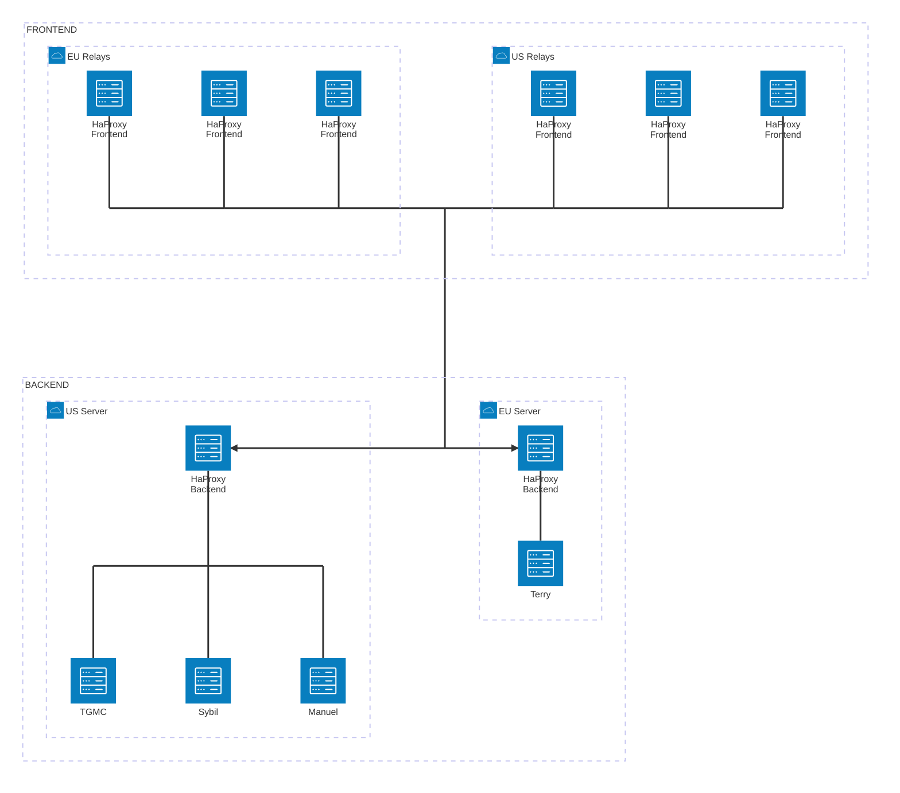
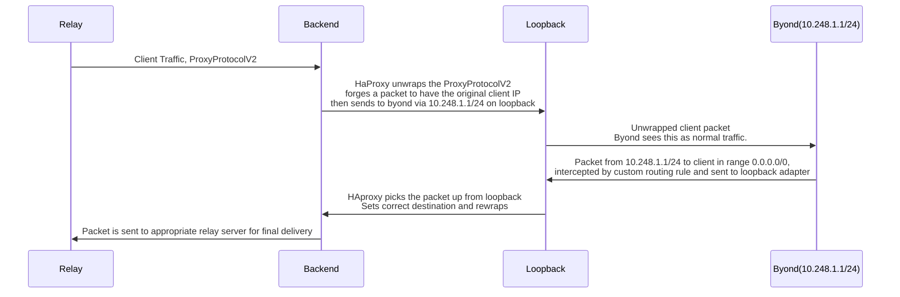

# /tg/station Infrastructure
[](https://github.com/tgstation-operations/infrastructure/actions/workflows/colmena.yml)

This repository holds the IaC Config for the /tg/station Space Station 13 Server. This is built primarily using nix with [Colmena](https://github.com/zhaofengli/colmena)

This place is not a place of honor... no highly esteemed deed is commemorated here... nothing valued is here.
# Single points of failure

oranges - out of band access to lime/ domain owner

mothblocks - out of band access to blockmoths and eu relays

scriptis/lorwp - cloudflare dns

# Server owners
* lime - oranges (ovh us vm, forum/wiki host and relay)
* tgsatan - scriptis (dedicated)
* chicago, dallas, atlanta (scriptis, vultr relays)
* warsaw - scriptis (nobody knows??)
* wiggle - riggle (magic??)
* blockmoths - mothblocks (hetzner dedi)
* knipp,daschund,bratwurst - mothblocks (hetzner vm relays)

# Repository structure
```
<blorbo_name> = placeholder for the name of a blorbo
[/root/some/path] = this folder follows the same structure as /root/some/path 

root/
|-  modules/
|   |-  <single_file_module_name>.nix
|   |-  <module_name>/
|   |   |-  <file_name>
|   |   |-  default.nix
|-  secrets/
|   |-  secrets.nix
|   |-  <secret_name>.age
|-  systems/
|   |-  <system_name>/
|   |   |-  default.nix
|   |   |-  modules/ [root/modules]
|   |   |-  secrets/ [root/secrets]
|   |-  <system_group_name>/
|   |   |-  modules/ [root/modules]
|   |   |-  secrets/ [root/secrets]  
|   |   |-  systems/ [root/systems]  
``` 

# Flow of byond packets through infrastructure

# Explanation of how the transparent proxying works with HAproxy

